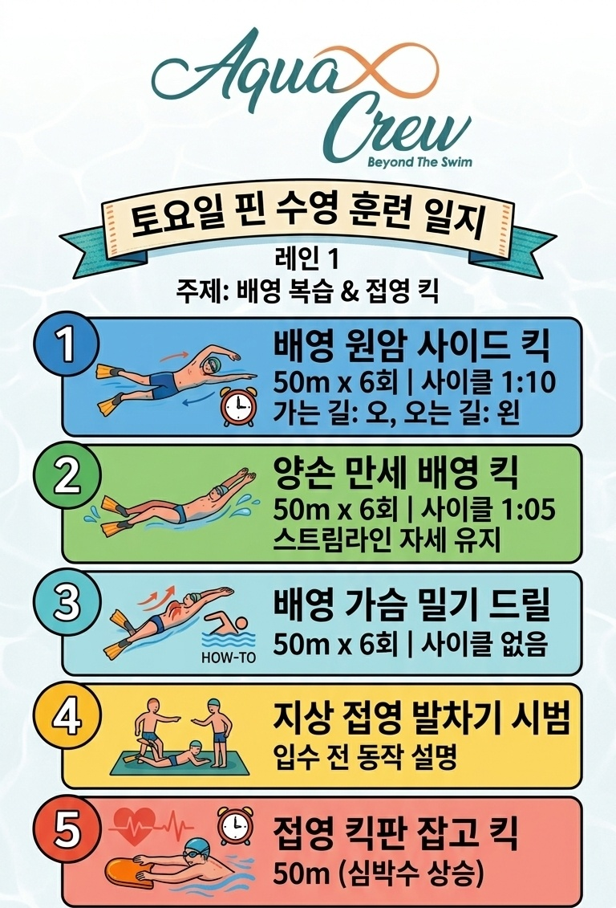

# 🏊‍♂️ 코칭훈련 (2026-08-22)

---

### 📊 훈련 요약표

| 구분 | 훈련 항목 | 장비 | 주요 내용 |
| :--- | :--- | :--- | :--- |
| **드릴 1** | 한 팔 배영 킥 | 오리발 | 50m 기준 (갈 때 오른팔 / 올 때 왼팔), 대각선 아래 누르기 |
| **드릴 2** | 양손 만세 배영 킥 | 오리발 | 만세 자세 유지, 손목 각도 세팅 후 발차기 |
| **드릴 3** | 배영 가슴 밀기 스위치 | - | 수면 터치 시 스위치, 어깨·가슴·허리 회전(3~5시 방향) |
| **드릴 4** | 구간별(1·2·3) 스위치 배영 | - | 리커버리 팔 1·2·3번 분할, 글라이드 유지 후 콤보 연결 |
| **드릴 5** | 킥판 잡고 접영 킥 | 킥판 | 가슴·허리 활용 큰 파도 파동 발차기 |
| **지상 훈련** | 마무리 지상 운동 | - | 총 30분 진행 |

---

### 📝 세부 훈련 내용

#### 1. 한 팔 배영 킥 (오리발)
* **진행 방식:** 50m 기준 (갈 때 오른팔 / 올 때 왼팔)
* 💡 **포인트:**
  * 손목 바깥쪽이 바닥을 향하게 하고, 손바닥 쪽으로 살짝 접어주기
  * 머리·어깨보다 **대각선 아래로 깊게 눌러** 자연스러운 몸 기울임(롤링) 형성

#### 2. 양손 만세 배영 킥 (오리발)
* **진행 방식:** 양손 만세 자세 유지하며 킥 수행
* 💡 **포인트:**
  * 양 손목 바깥쪽이 바닥을 보게 한 뒤, 손바닥 쪽으로 살짝 각 만들기

#### 3. 배영 가슴 밀기 스위치
* **진행 방식:** 리커버리하여 넘어온 손이 수면에 닿는 순간 스위치
* 💡 **포인트:**
  * 팔 힘이 아닌 **물 미는 힘과 코어 회전**으로 어깨·가슴·허리를 3~5시 방향으로 회전

#### 4. 구간별(1·2·3) 스위치 배영
* **진행 방식:** 리커버리 팔 위치를 1번, 2번, 3번 구간으로 분할하여 연습
* 💡 **포인트:**
  * 리커버리 팔이 지정 구간에 올 때까지 반대 손은 **가슴 밀기 글라이드 유지**
  * 지정 구간 도달 시 정확한 스위치 타이밍을 잡아 배영 콤보 연결

#### 5. 킥판 잡고 접영 킥
* **진행 방식:** 킥판 잡고 수면 킥 연습
* 💡 **포인트:**
  * 단순 발차기가 아닌 **가슴과 허리를 위아래로 크게 움직여** 큰 파도를 만드는 느낌으로 출렁임 만들기

---

### 🧘‍♂️ 지상 훈련 (DRYLAND)
* **마무리 지상 운동:** 총 30분 진행 (코어 및 스트레칭 세션)

